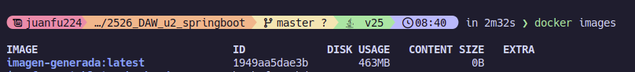
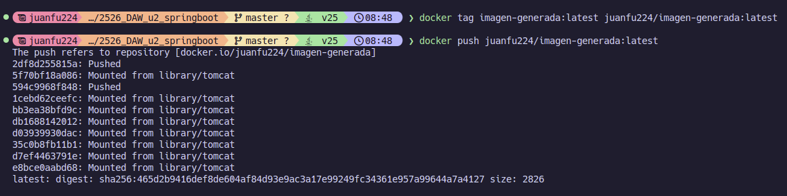

Para empezar a hacer esta practica, me he clonado el repositorio directamente desde el proyecto del profesor. Una vex descargado he generado la imagen con el siguiente comando:
```bash
docker build -t imagen-generada .
```

Una vez terminado de ejecutarse el comando aparecerá la imagen generada en nuestra lista de imagenes:


Para poder subirlo es necesario darle primero un tag y ya despues puede subirse a docker hub. Para poder hacerlo hay que ejecutar los siguiente comandos:

```bash
docker tag imagen-generada:latest juanfu224/imagen-generada:latest
```

Te tiene que aparecer el siguiente resultado

Para cambiar añádir mi nomnbre al lado del titulo de la pagina, he tenido que editar la siguiente linea en build/resources/main/templates/index.html

https://github.com/Juanfu224/2526_DAW_u2_springboot/blob/8fab9385dc4b327ad33474c0e3a9de5b99673d09/src/main/resources/templates/index.html#L123


